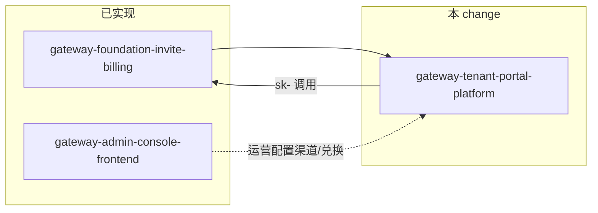

## Context

- **参考产品**：蓝移 API（lanyiapi.com）— 企业级多模型接入网关，含营销站、模型广场、租户控制台、按 Token/按次计费、多区域节点、操练场与钱包/邀请体系（详见 `zhencai/lanyiapi-site-audit/IMPLEMENTATION_PROMPT.md`）。
- **本仓库现状**：
  - 后端：`gateway-foundation-invite-billing` 已实现 `sk-` 网关、`/v1/chat/completions`、额度预扣/结算、兑换/邀请、基础 `POST /user/api-keys`。
  - 前端：`gateway-admin-console-frontend` 已实现 Ant Design **`/admin/*`** 运营台。
- **缺口**：无 Semi 租户门户、无 `/pricing` 模型广场、无看板/日志/钱包/操练场页面；OpenAPI 无 `/api/dashboard/*`、`/api/logs/*`、令牌完整 CRUD。

## Goals / Non-Goals

**Goals**

- 交付 **业务等价** 的租户自助体验：开发者注册 → 创建 `sk-` → 模型广场查价 → 看板查用量 → 操练场调试 → 钱包充值/兑换/邀请。
- **契约驱动**：租户面 API 写入 `backend/internal/openapi/spec.yaml`；路径优先对齐参考站 `/api/*`，与现有 `/auth/*`、`/user/*` 通过 BFF 或别名兼容。
- **UI 验收**：间距/文案/分区对照 `lanyiapi-site-audit/screenshots/`；登录按钮 **「继续」**；侧栏菜单项与参考站一致。
- **分 Phase 可合并**：每 Phase 可独立演示（见 `tasks.md`）。

**Non-Goals**

- 蓝移商标、域名、企业微信二维码等运营素材硬编码（用配置/占位）。
- 生产级 Turnstile、支付（本期 mock + 环境变量开关）。
- 合并 Admin（Ant Design）与 Portal（Semi）为同一 SPA 路由树（避免双设计系统冲突）。

## 仓库布局（建议）

```
ai-api-gateway/
  backend/                 # 扩展 handler + migrations
  frontend/                # 现有 Ant Design 管理端（不变）
  portal/                  # 新建：Next.js 14 + Semi 租户门户
    app/
      (marketing)/         # /, /pricing, /about, /login, /register
      console/             # /console/*
    ...
  openspec/changes/gateway-tenant-portal-platform/
```

`NEXT_PUBLIC_GATEWAY_API_URL` 指向同一 Go 网关；门户与管理端可同域不同路径或子域部署。

## 信息架构（IA）

### 公开站

| 路由 | 页面 |
|------|------|
| `/` | 首页营销 + 公告 Modal |
| `/pricing` | 模型广场 |
| `/about` | 关于 |
| `/register` | 注册（`?aff=`） |
| `/login` | 登录（主按钮「继续」） |

### 控制台（需登录）

| 分组 | 菜单 | 路由 |
|------|------|------|
| 聊天 | 操练场 | `/console/playground` |
| 控制台 | 数据看板 | `/console` 或 `/console/dashboard` |
| 控制台 | 令牌管理 | `/console/token` |
| 控制台 | 使用日志 | `/console/log` |
| 控制台 | 任务日志 | `/console/task` |
| 个人中心 | 钱包管理 | `/console/wallet` |
| 个人中心 | 个人设置 | `/console/setting` |

顶栏（全局）：`首页` | `控制台` | `模型广场` | `文档` | `关于` + 通知/主题/语言/用户菜单。

## 领域模型（增量）

在 `gateway-foundation-invite-billing` 已有 `users`、`api_keys`、`model_prices`、`request_logs` 等基础上扩展：

| 实体 | 说明 |
|------|------|
| `TokenGroup` | 分组名、`multiplier`（如 default 1x、vip、claude_code 1.5x） |
| `ApiToken` | 扩展：分组 ID、quota 上限、enabled、allowed_models[]、ip_whitelist[] |
| `Model` | 展示用元数据：provider、endpoint_type（openai/anthropic）、分项单价 |
| `UsageLog` | 对齐 `request_logs` 或视图：首字耗时、流式标记、分组倍率、计费明细 JSON |
| `TaskLog` | 异步任务：platform、type、status、progress |
| `Announcement` | 公告：级别、正文、生效时间 |
| `Wallet` | 余额字段复用 `users.quota`；充值订单、待结算邀请收益 |

ER 与迁移在 Phase 1–3 后端任务中落库。

## API 分层

### 已有（复用）

- `POST /auth/register`、`POST /auth/login`（JWT）
- `POST /user/api-keys`、`POST /user/redeem`
- `GET /v1/models`、`POST /v1/chat/completions`（`sk-`）

### 待新增（租户 JWT）

| 方法 | 路径 | 用途 |
|------|------|------|
| GET | `/api/user/self` | 当前用户 profile、余额、分组 |
| GET/POST/PUT/DELETE | `/api/tokens` | 令牌 CRUD |
| GET | `/api/models` | 模型广场（筛选/分页） |
| GET | `/api/dashboard/stats` | 四卡指标 |
| GET | `/api/dashboard/charts` | 时序图表 |
| GET | `/api/logs/usage` | 使用日志 |
| GET | `/api/logs/tasks` | 任务日志 |
| POST | `/api/playground/chat` | 操练场 SSE |
| GET/POST | `/api/wallet/*` | 充值 mock、兑换、邀请划转 |
| GET | `/api/announcements` | 公告列表 |

网关面：`POST /v1/messages`（Anthropic）为 P1。

### 鉴权约定

- 租户 REST：`Authorization: Bearer <JWT>`（来自 `/auth/login`）。
- 网关调用：`Authorization: Bearer sk-...`。
- 未登录访问 `/console/*` → Toast「未登录或登录已过期」→ `/login?expired=true`。

## UI/UX（对齐参考站）

- **Semi Design** 浅色主题；主色 `#007AFF`；卡片圆角 8–12px。
- 表格：紧凑模式、列设置、默认每页 10 条。
- 图表：ECharts/Recharts；看板 sparkline。
- 图标：Lucide React。

## 与现有 change 的关系



## Risks

| 风险 | 缓解 |
|------|------|
| Semi 与 Ant Design 双前端维护成本 | 目录分离 `portal/` vs `frontend/`；共享 OpenAPI 类型生成 |
| 参考站 `/api/*` 与现有 `/auth/*` 不一致 | OpenAPI 同时文档化；实现层 handler 复用 service |
| 日志/看板查询性能 | 分页 + 索引 + 异步写 `request_logs`（已有） |
| 操练场滥用额度 | 独立 playground 令牌或速率限制 |

## References

- `openspec/changes/gateway-tenant-portal-platform/proposal.md`
- `zhencai/lanyiapi-site-audit/IMPLEMENTATION_PROMPT.md`
- `openspec/changes/gateway-foundation-invite-billing/design.md`
